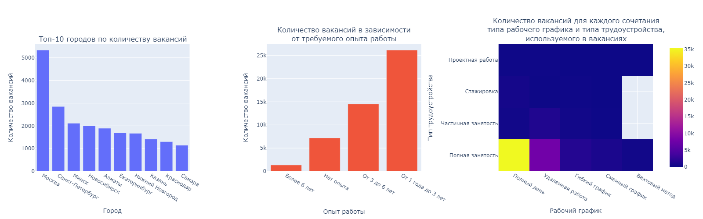
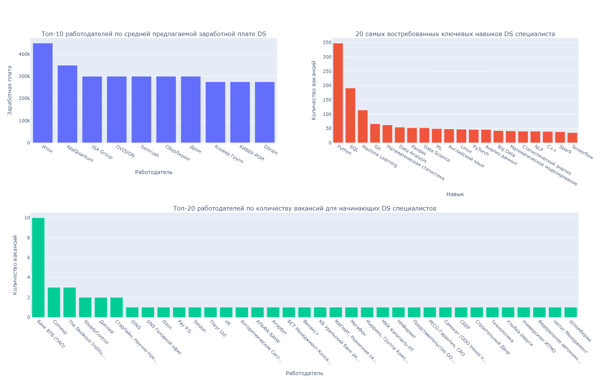

# Проект 2. Анализ вакансий из HeadHunter

## Оглавление:
[1. Предварительный анализ данных](#предварительный-анализ-данных)  
[2. Детальный анализ вакансий](#детальный-анализ-вакансий)  
[3. Анализ работодателей](#анализ-работодателей)  
[4. Предметный анализ](#предметный-анализ)  
[5. Дополнительное исследование и общий вывод по проекту](#дополнительное-исследование-и-общий-вывод-по-проекту) 

### Описание проекта    
Общий анализ вакансий и анализ вакансий на позицию Data-Science специалиста из HeadHunter.  

### Предварительный анализ данных
- Количество вакансий - 49197
- Количество работодателей - 23501
- Количество регионов - 1362
- Количество сфер деятельности - 294

#### Выводы:
- Работодатели в среднем оставляют по 2 вакансии
- На одну сферу дейтельности в среднем размещено 167 вакансий, что указывает на высокую потребность в специалистах

### Детальный анализ вакансий
- Количество вакансий с указанной заработной платой - 24073
- Средняя нижняя зп - 71065 руб., средняя верхняя зп - 110537 руб.

#### Выводы
- Половина работодателей не указывают заработную плату
- Средняя верхняя зп в 1.55 раза выше чем нижняя
- Больше всего вакансий в городе Москва
- Чаще всего работодатели указывают требуемый опыт работы от 1-го до 3-х лет. Работодатели предпочитают нанимать уже опытных специалистов
- Полная занятость на полный день указана в 70% вакансий

### Анализ работодателей
- Количество работодетелей у которых не указана сфера деятельности - 8419
- Количество работодателей, в качестве сферы деятельности которых указана Разработка программного обеспечения - 3553

#### Выводы:
- В 36% вакансий не указана сфера деятельности
- В 15% вакансий в качестве сферы деятельности которых указана __Разработка программного обеспечения__
- Компания "Яндекс" оставляет значительно больше вакансий остальных компаний и отдаёт приоритет городам-миллионикам 

### Предметный анализ
- Количество вакансий, которые имеют отношения к Data-Science - 1771
- Количество подходящих вакансий для начинающего DS - 51
- Количество вакансий для DS, в которых в качестве ключевого навыка указан SQL или postgres - 201
- Количество вакансий для DS, в которых в качестве ключевого навыка указан Python - 351
- Количество ключевых навыков, которые в среднем указывают в вакансиях для DS - 6.41

#### Выводы:
- 3.6% вакансий имеют отношение к Data Science, что указывает на высокий спрос на специалистов в данной области
- 2.8% вакансий имеющих отношение к Data Science подходит начинающим, что указывает на высокий порог входа в профессию
- Чтобы значительно увеличить шансы на получение получение рабочего места, DS специалисту необходимо владеть минимум 6-ю навыками, в частности Python и SQL

### Дополнительное исследование и общий вывод по проекту

#### Общие выводы:
- В целом рынок труда нуждается в опытных специалистах, но есть возможности и у начинающих 
- DS специалист должен владеть как минимум 6-ю навыками, самые важные из них: Python, SQL, Machine Learning, GIT, Математическая статистика, Pandas и Английский язык
- Чем выше опыт работы, тем выше заработная плата